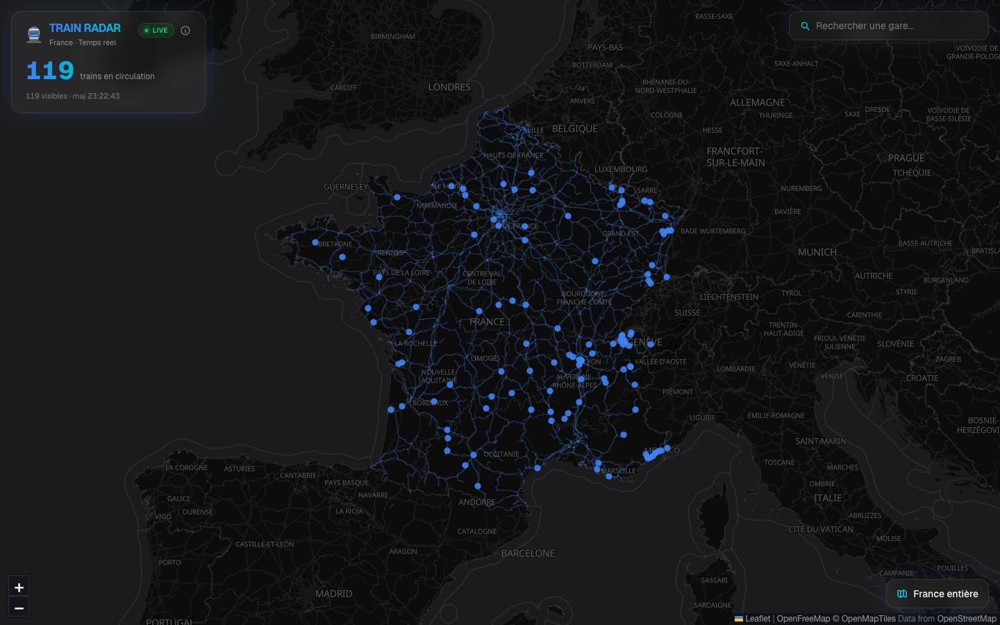

# Train Radar

Live map of the regional (TER) trains running across France, with each train's position recomputed every second between two stations.

**[Open the map →](https://sacha9214.github.io/train-radar/)**



## Features

- **Interpolated positions**, updated every second between the previous and next station, with the train's heading
- **Real national rail network geometry** (SNCF GeoJSON)
- **Zoom-aware rendering**: dots when zoomed out, oriented train silhouettes and the full route when zoomed in
- **Station search**
- **Canvas rendering** with viewport culling, so the map stays smooth with hundreds of trains

## How it works

1. `scripts/preprocess-gtfs.ts` turns the SNCF GTFS export into a compact file, `public/gtfs-today.json`: trips, stops, coordinates and times
2. In the browser, `components/TrainMap.tsx` loads that file and computes the position of every running train between two stops
3. The site is statically exported (`output: "export"`) and published to GitHub Pages by GitHub Actions on every push to `main`

## Limitations

Positions come from scheduled timetables, not from train GPS: delays and cancellations are not shown.

## Stack

Next.js 16 · React 19 · TypeScript · Leaflet · MapLibre GL (OpenFreeMap basemap) · Tailwind CSS 4 · GitHub Actions

## Run locally

```bash
npm ci
npm run dev
# http://localhost:3000/train-radar
```

## License

[MIT](LICENSE)
